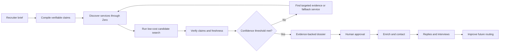
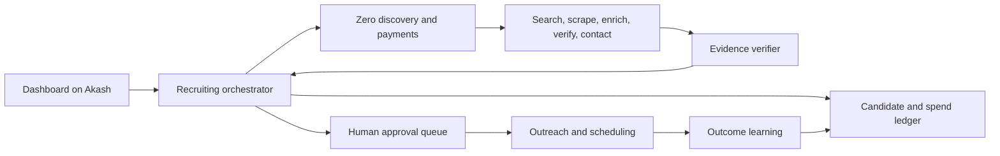

# Roster

**Hire with evidence.**

Roster is an autonomous recruiting agent that finds, verifies, enriches, and helps recruiters contact high-fit candidates. It dynamically discovers and uses pay-per-call services through [Zero](https://www.zero.xyz/), keeps every claim tied to evidence, and runs its dashboard and agent runtime on [Akash Network](https://akash.network/).

Instead of returning another opaque list of “AI-matched” profiles, Roster shows recruiters **why** each person fits, **where** every claim came from, **how fresh** the evidence is, and **what it cost** to verify.

## The problem

Recruiters can find plenty of plausible profiles. The expensive part is determining which candidates actually satisfy a nuanced hiring brief before contacting them.

- Profiles become stale.
- Search results match keywords without proving experience.
- Enrichment providers return conflicting information.
- Availability and career-transition signals expire quickly.
- Verifying niche skills requires research across many sources.
- Personalized outreach based on incorrect assumptions damages trust.
- Teams pay for deep enrichment before knowing whether a candidate clears the basic requirements.

Roster turns every hiring requirement into a verifiable claim and buys only the evidence needed to resolve it.

## What Roster does

Give Roster a natural-language hiring brief such as:

> Find a founding infrastructure engineer with production Rust and Kubernetes experience, active open-source work, startup experience, and signs they may be open to a new role.

Roster then:

1. Converts the brief into must-haves, preferences, and exclusions.
2. Discovers relevant search, scraping, enrichment, and verification services through Zero.
3. Builds an initial candidate pool using inexpensive sources.
4. Eliminates candidates who fail hard requirements before purchasing costly enrichment.
5. Investigates missing or contradictory claims with targeted tool calls.
6. Produces an evidence-backed dossier for each qualified candidate.
7. Requests human approval before unlocking contact data or sending outreach.
8. Tracks replies and interview outcomes to improve future source selection.

## Why Zero

Zero is not a single data provider inside Roster. It is Roster's dynamic capability and payment layer.

For each unresolved claim, Roster can discover competing services, compare their price and expected value, call the best candidate, verify the result, and fall back when necessary. This makes sourcing adaptive rather than hard-coded to a fixed enrichment stack.

Example decision:

> Apollo and PDL are likely to return overlapping data. Roster selected the lower-cost option first, then used targeted web research only for the remaining unverified Rust claim.

Roster records every Zero call with:

- Service and capability
- Candidate and purpose
- Quoted and actual price
- Latency and result status
- Evidence gained
- Retry or fallback reason
- Contribution to the final candidate score

This turns Zero's service marketplace into an autonomous recruiting supply chain optimized for verified outcomes.

## The recruiting loop



## Dashboard

### Command Center

An operational overview of:

- Active roles
- Candidates discovered, verified, and awaiting approval
- Outreach responses and interviews booked
- Current agent activity
- Total Zero spend
- Cost per verified candidate
- Cost per positive response
- Cost per booked interview

### Role Brief

Roster translates natural language into an editable evaluation contract:

| Requirement | Priority | Example verification |
| --- | --- | --- |
| Production Rust | Must-have | GitHub, technical writing, work history |
| Kubernetes | Must-have | Projects, profile, conference material |
| Startup experience | Must-have | Employment and company history |
| Recent OSS activity | Must-have | Public contributions within 60 days |
| Transition signal | Preferred | Recent posts, departure, role change |
| Bay Area | Preferred | Current public location evidence |

### Live Search

Recruiters can watch the loop work in real time:

```text
✓ Discovered 11 relevant Zero capabilities
✓ Selected a low-cost profile search
✓ Found 36 possible candidates
✓ Rejected 21 on hard requirements
→ Verifying Rust evidence for 15 candidates
✗ Candidate claim contradicted by a recent profile
→ Trying targeted web research
✓ 6 candidates reached the verification threshold
```

### Candidate Pipeline

```text
Discovered → Researching → Verified → Approved → Contacted → Replied → Interview
```

Each candidate card includes:

- Match and evidence-confidence scores
- Evidence freshness
- Strongest matching signal
- Missing or contradictory requirements
- Verification spend
- Current agent action

### Evidence Dossier

Roster makes every decision inspectable:

```text
Production Rust                                      VERIFIED

Evidence
• Maintains a Rust networking repository
• Previous employer's engineering article names their work
• Conference talk describes production Rust services

Cross-source agreement: 3/3
Confidence: 96%
Newest evidence: 12 days ago
Cost to verify: $0.014
```

Contradictions are surfaced rather than hidden:

```text
Open to opportunities                                UNCERTAIN

Supporting: recent departure from previous employer
Contradicting: personal site says “not considering new roles”

Recommendation: require manual review before outreach.
```

### Zero Tool Arena

The Tool Arena explains how Roster procures evidence:

| Service | Task | Cost | Latency | Outcome | Evidence gained |
| --- | --- | ---: | ---: | --- | ---: |
| Profile scraper | Profile extraction | $0.002 | 2.1s | Success | 3 claims |
| Person enrichment | Structured history | $0.008 | 3.8s | Success | 2 claims |
| Alternate enrichment | Structured history | $0.020 | — | Skipped | Expected duplicate |
| Targeted search | Missing Rust evidence | $0.007 | 4.3s | Success | 1 critical claim |
| Deep profile search | Full investigation | $0.300 | — | Skipped | Over budget |

### Spend Management

Spend is a first-class recruiting constraint, not an afterthought.

Recruiters can configure:

- Wallet and monthly spending limits
- Budget per role
- Maximum spend per candidate
- Maximum price per tool call
- Retry and fallback budgets
- Contact-enrichment and outreach budgets
- Approval thresholds and automatic stop conditions

Roster reports:

- Actual versus projected spend
- Cost per discovered, verified, approved, and contacted candidate
- Cost per response and booked interview
- Spend by role, candidate, and Zero service
- Failed-call and retry costs
- Money saved by skipping duplicate or unnecessary enrichment
- A receipt for every paid action

### Outreach Studio

For approved candidates, Roster creates messages grounded only in verified evidence. Recruiters can inspect which sources informed each personalized sentence, remove uncertain claims, preview the sending cost, and approve the action.

Consequential actions remain human-controlled. Roster requires explicit approval before:

- Unlocking private contact details
- Exceeding research budgets
- Sending email or initiating other outreach
- Starting follow-up sequences
- Making phone calls

### Outcomes and Learning

Roster learns from recruiting outcomes:

- Positive replies reward the evidence strategy that found the candidate.
- Incorrect claims penalize their contributing sources.
- Bounced contact details penalize the enrichment workflow.
- Recruiter rejection identifies misweighted requirements.
- Booked interviews strengthen the signals that predicted interest.
- Failed Zero services can be reviewed or reported.

## Candidate scoring

Candidates must pass every hard requirement before ranking. Successful candidates are then scored using:

```text
35%  must-have evidence coverage
20%  source credibility
20%  evidence freshness
15%  cross-source agreement
10%  cost efficiency
```

A candidate cannot be marked **Verified** while a must-have criterion lacks cited evidence.

## Happy path

1. **Create a role** — Describe the ideal candidate in plain language.
2. **Review the claims** — Edit must-haves, preferences, weights, and exclusions.
3. **Set the budget** — Define role, candidate, tool-call, and approval limits.
4. **Start sourcing** — Roster discovers Zero services and creates an initial pool.
5. **Qualify cheaply** — Obvious mismatches are removed before deep enrichment.
6. **Investigate uncertainty** — Targeted services resolve only the missing claims.
7. **Review the shortlist** — Inspect citations, confidence, freshness, conflicts, and cost.
8. **Approve enrichment** — Purchase contact information only for selected candidates.
9. **Approve outreach** — Review evidence-grounded personalization before sending.
10. **Track outcomes** — Move candidates through replies and interviews.
11. **Improve** — Feed outcomes back into future service and signal selection.

## Running on Akash

Roster's web dashboard, recruiting orchestrator, background agent loop, event stream, evidence store, and spend ledger are designed to run on Akash's decentralized cloud.



Akash provides the continuously running infrastructure; Zero provides the capabilities Roster purchases as each recruiting objective demands.

## Demo scenario

> Find three engineers who could become the founding infrastructure engineer at an agentic-AI startup: production Rust, Kubernetes, open-source activity within 60 days, startup experience, and a current transition signal.

During the demo, Roster:

1. Compiles the role into explicit claims.
2. Discovers relevant Zero services and displays their prices.
3. Uses a low-cost strategy to find initial candidates.
4. Rejects one candidate because a must-have cannot be proven.
5. Detects contradictory availability evidence for another candidate.
6. Purchases targeted evidence for a promising candidate.
7. Raises that candidate's confidence from uncertain to verified.
8. Shows the complete evidence dossier and spend receipt.
9. Produces recruiter-approved, evidence-grounded outreach.

## Principles

- **Evidence over inference** — Important claims require sources.
- **Cheap before deep** — Expensive enrichment follows qualification.
- **Uncertainty stays visible** — Contradictions are product information.
- **Humans approve consequences** — Research may be autonomous; outreach is controlled.
- **Every dollar is attributable** — Spending must produce measurable value.
- **Outcomes improve routing** — The system learns which tools and signals actually lead to interviews.

## Built for the Loop Engineering Hackathon

Roster demonstrates a complete autonomous loop:

```text
Understand → Discover → Spend → Verify → Correct → Approve → Act → Learn
```

**Other recruiting tools sell candidate lists. Roster buys evidence—and spends more only when uncertainty is worth resolving.**
